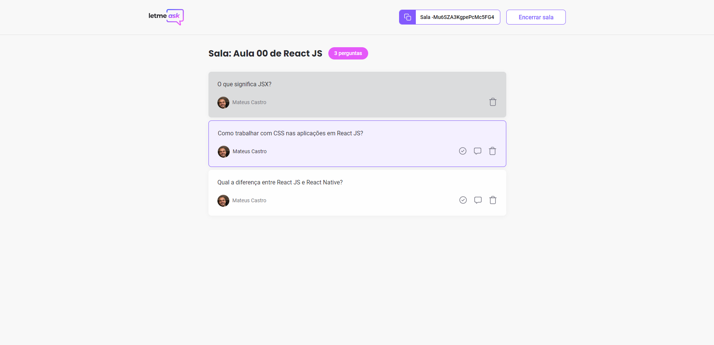
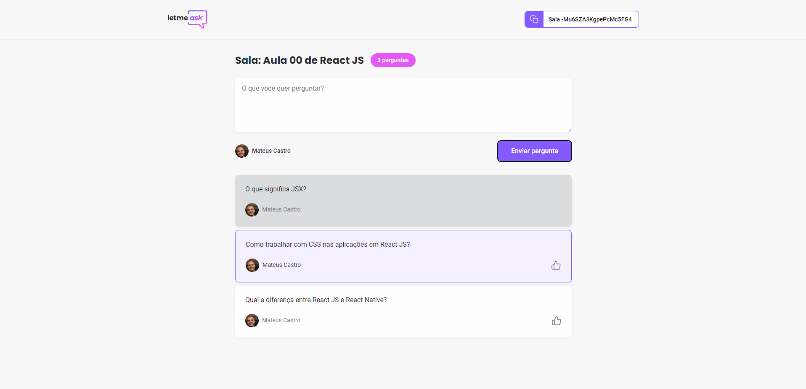

  

  <a href="#-tecnologias">Tecnologias</a>&nbsp;&nbsp;&nbsp;|&nbsp;&nbsp;&nbsp;
  <a href="#-projeto">Projeto</a>&nbsp;&nbsp;&nbsp;|&nbsp;&nbsp;&nbsp;
  <a href="#-layout">Layout</a>&nbsp;&nbsp;&nbsp;|&nbsp;&nbsp;&nbsp;
  <a href="#-como-executar">Como executar</a>&nbsp;&nbsp;&nbsp;|&nbsp;&nbsp;&nbsp;
  <a href="#-licença">Licença</a>

 

  

 

  

## ✨ Tecnologias

Esse projeto foi desenvolvido com as seguintes tecnologias:

- [Sass](https://sass-lang.com)
- [React](https://reactjs.org)
- [Firebase](https://firebase.google.com)
- [TypeScript](https://www.typescriptlang.org)

## 💻 Projeto

O letmeask é uma plataforma que permite a criação de salas de Q&amp;A para criadores de conteúdo interagirem com seu público.

## 🔖 Layout

Você pode visualizar o layout do projeto através [desse link](https://www.figma.com/file/wKFVdtx8c7MlM0L0xqUzAu/letmeask). É necessário ter conta no [Figma](http://figma.com/) para acessá-lo.

## 🚀 Como executar

- Clone o repositório
- Instale as dependências com `yarn`
- Crie um projeto no Firebase
- Configure a autenticação com o Google
- Configure um Realtime Database seguindo as regras de segurança do arquivo `database.rules.json`
- Inicie o servidor com `yarn start`

Agora você pode acessar [`localhost:3000`](http://localhost:3000) do seu navegador.

## 📄 Licença

Esse projeto está sob a licença MIT. Veja o arquivo [LICENSE](LICENSE.md) para mais detalhes.
